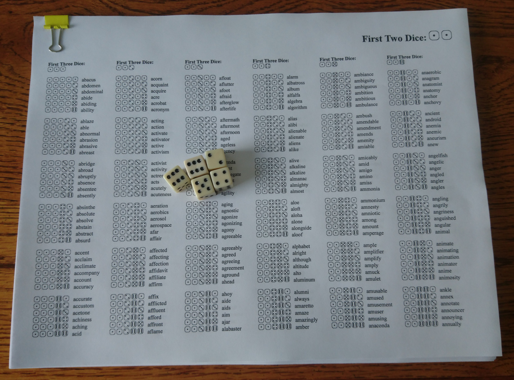

# Printer-Friendly Diceware

Website: https://diafygi.github.io/diceware-prettyprint/

[Download example printout [pdf]](files/eff_diceware.pdf)

## What does this project do?

This project generates an easy-to-use printout of a Diceware wordlist. Simply
select a word list file from your local computer and the website will generate
a printer-friendly version of the word list with little dice icons.

The generated printout is 36 pages long, where each page has 6 columns of 36
words separated into 6 groups. This means that each page represents the first two
dice, each column represents the third dice, each group represents the fourth
dice, and each word is the fifth dice. This format makes it super fast to find
the particular word when flipping through the pages. I play-tested this with my
mom, and she had no problem figuring out where to go lookup the word from her
dice roll.

This project is "unhosted", which means it does everything client-side
(javascript renders the pages and the dice icons are in css) and no central
server is needed. If you want to run a local copy of this website, simply
right-click and "Save Page As"!

## What is Diceware?

[Diceware](https://en.wikipedia.org/wiki/Diceware) is a method for creating easy-to-remember
random passwords by rolling 5 dice and looking up the number from a word list containing
7,776 words (6^5). There are many word lists
(including the [EFF](https://www.eff.org/deeplinks/2016/07/new-wordlists-random-passphrases),
[original list](http://world.std.com/~reinhold/diceware.html),
and [other languages](http://world.std.com/~reinhold/diceware.html#Diceware%20in%20Other%20Languages|outline)).

## How do I print?

* Use the print preview function in your browser
* Landscape mode
* Turn on background images
* Scale until each page fits (I have to zoom out to ~75%)

## Donate

If this project is useful to you, please donate to the EFF. I don't work there,
but they do fantastic work.

[https://eff.org/donate/](https://eff.org/donate/)

## Feedback/Contributing

Released under MIT license.

Happy to receive pull requests, but my goal is to keep this project simple and
tiny. It's supposed to [work](http://motherfuckingwebsite.com/), nothing more.

